<picture>
  <source media="(prefers-color-scheme: dark)" srcset="dark.svg">
  <source media="(prefers-color-scheme: light)" srcset="light.svg">
  
</picture>

 

### Hi there, I'm Olajesu Duro Francis 👋
**DevOps Engineer | Lagos, Nigeria 🇳🇬**

I switched from web development to DevOps because I realized the engineers who build and manage infrastructure will always be needed — regardless of where AI takes coding.

I build every day. Everything goes on GitHub.

 

### 🛠️ Tech Stack

**DevOps & Cloud**

**Development**

 

### 🚀 Projects

**🔧 Team Task Manager**
Full stack Kanban app built with Flask, React and PostgreSQL. Dockerized with CI/CD pipeline using GitHub Actions.

**🛡️ Linux Server Hardening Script**
Bash script that automatically secures a fresh Ubuntu server — UFW firewall, fail2ban, SSH hardening.

**⚡ Bash Automation Toolkit**
6 production-ready Linux automation scripts for system monitoring, backups and process management.

 

### 📊 GitHub Stats

 

### 🤝 Connect with me

 

> "The best engineers learn by building — and I build every day." 💪
